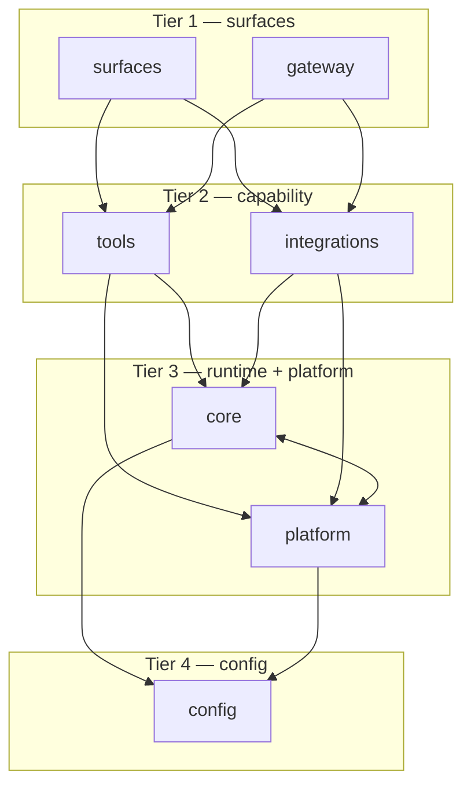
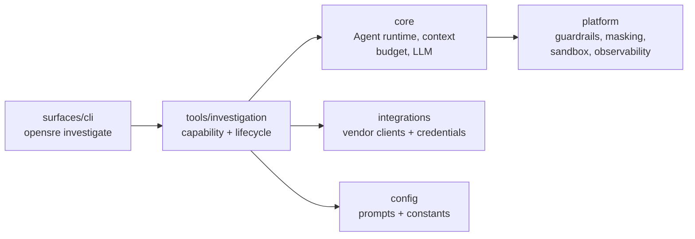
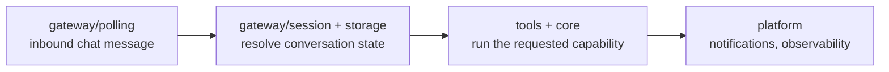

# OpenSRE architecture

How the OpenSRE codebase is structured: the seven first-party packages, what
each is responsible for, and which may depend on which. These dependency rules
are CI-enforced (`make check-imports`), so they are real invariants rather than
aspirations.

## The layer stack

The packages sit in four tiers. **Higher tiers may import lower tiers; a lower
tier may never import a higher one.** Packages on the same tier are peers — the
last column says whether peers may import each other.

| Tier | Packages | May import | Must never import | Peer rule |
| --- | --- | --- | --- | --- |
| 1 (top) | `surfaces`, `gateway` | `tools`, `integrations`, `core`, `platform`, `config` | — | Independent: must not import each other. |
| 2 | `tools` | `integrations`, `core`, `platform`, `config` | `surfaces`, `gateway` | May use an integration's client, so `integrations` effectively sits below it. |
| 2 | `integrations` | `core`, `platform`, `config` | `tools`, `surfaces`, `gateway` | Must never import `tools`; stays reusable below the tool layer. |
| 3 | `core`, `platform` | `config` | `surfaces`, `gateway`, `tools`, `integrations` | Siblings: **may** cross-import each other. |
| 4 (bottom) | `config` | — (nothing first-party) | everything above | Independent — imports no other first-party package. |

The shortcut: **dependencies point downward only.** A surface can reach all the
way down; `config` can reach nothing. The single deliberate exception is
`core ⟷ platform`, a mutually-dependent pair by design (see below).

The arrows show edges between **adjacent** tiers to keep the diagram readable.
The actual rule is broader: a tier may import **any** tier below it, not only
the one directly beneath — so a surface may import `config` directly, and a
tool may import `platform`. Refer to the "May import" column above for the
complete set of allowed edges.

## The layers in detail

### Tier 1 — `surfaces` and `gateway`

The entry points a human or an external system talks to. Nothing first-party
may import from here, so a surface can be added or removed without touching the
layers below it.

- **`surfaces/`** — one folder per UI/client: `surfaces/cli` (the stateless
  `opensre <command>` runner), `surfaces/interactive_shell` (the stateful
  REPL), `surfaces/slack_app` (Slack bot), and `surfaces/shared` for code two
  or more surfaces use. A surface owns its own I/O, prompts, and presentation,
  and composes lower layers to do the actual work.
- **`gateway/`** — the standalone messaging gateway for inbound chat platforms
  (`gateway/polling`, `gateway/session`, `gateway/storage`). A peer of
  `surfaces`, not a child: the two never import each other.

### Tier 2 — `tools` and `integrations`

The capability layer — "do a thing against the outside world" — split by
responsibility:

- **`integrations/`** — the boundary for **user config and external clients**:
  per-vendor config normalization, verification (`verifier.py`), API clients
  (`client.py`), the store/catalog that resolves credentials, and
  integration-local helpers. One folder per vendor (`integrations/datadog`,
  `integrations/grafana`, `integrations/github`, …) plus cross-cutting pieces
  like `integrations/hermes` and `integrations/llm_cli`.
- **`tools/`** — the **agent-callable** boundary: every `@tool(...)` function
  and `BaseTool` subclass, the tool registry, framework subsystems
  (`tools/investigation`, `tools/interactive_shell`), `tools/system/` for
  tools with no vendor in their domain purpose (`fleet_monitoring`,
  `python_execution_tool`, `sre_guidance_tool`, `watch_dog`), and
  `tools/cross_vendor/` for tools whose logic spans 2+ vendor integrations
  (`fix_sentry_issue`). See
  [tool-placement-policy.md](tool-placement-policy.md) for the full decision
  rule, including when a tool belongs under `integrations/<vendor>/tools/`
  instead. A tool is what the planner selects and the runtime executes.

The import rule between them is one-directional: `integrations` must never
import `tools` (or `surfaces`), so a vendor client never depends on the agent
layer and stays reusable on its own. The reverse edge is allowed and common — a
tool reaches an integration's client for external data — so `integrations`
effectively sits one step below `tools` in the dependency graph. Do **not**
reintroduce top-level `vendors/` or `services/` packages — external-system code
belongs in `integrations/`, agent-callable code in `tools/`.

### Tier 3 — `core` and `platform`

The shared runtime and cross-cutting services the capability layer is built on.

- **`core/`** — the provider-agnostic agent runtime: the think → call tools →
  observe loop (`core.agent.Agent`), agent/investigation state (`core/state`) and
  context-budget enforcement (`core/context_budget.py`), the tool framework primitives
  (`core/tool_framework`), shared LLM clients (`core/llm`), agent-harness
  session handling (`core/agent_harness`), and pure domain rules (`core/domain`).
- **`platform/`** — cross-cutting services with no investigation logic of their
  own: guardrails, masking, sandbox, analytics, auth, notifications,
  observability, scheduler, and deployment. It deliberately shadows the stdlib
  `platform` name and re-exposes it, so `import platform` still works.

These two are the one bidirectional pair by design: `core` reaches `platform`
for guardrails, masking, observability, and evidence/log compaction, while
`platform` reaches back into `core` for the shared state and session types
(`core.state`, `core.agent_harness.session`). Splitting them into
separate tiers would forbid that edge, so they share a tier as siblings.

### Tier 4 — `config`

The floor: shared constants, prompts, UI theme, and the web app entrypoint
(`config/webapp.py`). Everything above may read from `config`, but `config`
imports no other first-party package — keeping it a leaf means constants can be
imported anywhere without dragging runtime along.

## Cross-layer flows

Two worked examples showing how control descends the stack and results flow back
up. Arrows only ever cross a boundary downward.

### An investigation from the CLI

1. `surfaces/cli` parses the command and hands off to the investigation
   capability in `tools/investigation` — the surface never runs pipeline logic
   itself.
2. `tools/investigation` drives the six-stage pipeline (see
   [`investigation-pipeline-architecture.md`](investigation-pipeline-architecture.md)),
   asking `core` to run the ReAct loop and select/execute tools.
3. Evidence-gathering tools reach `integrations` for vendor clients and resolved
   credentials; `core` and `platform` supply the runtime, guardrails, and
   masking around every call.
4. The structured diagnosis flows back up to the surface, which owns how it is
   presented or delivered.

### An inbound gateway message

`gateway` receives a message, resolves session state from its own storage, then
composes the same tier-2/tier-3 capability code a surface would — without ever
importing `surfaces`, since the two are independent tier-1 peers.

## Related docs

- [`AGENTS.md`](https://github.com/Tracer-Cloud/opensre/blob/main/AGENTS.md) —
  repo map and per-area "files to touch" guides.
- [`investigation-pipeline-architecture.md`](investigation-pipeline-architecture.md)
  — how a single investigation runs end-to-end within the `tools` + `core`
  layers.
