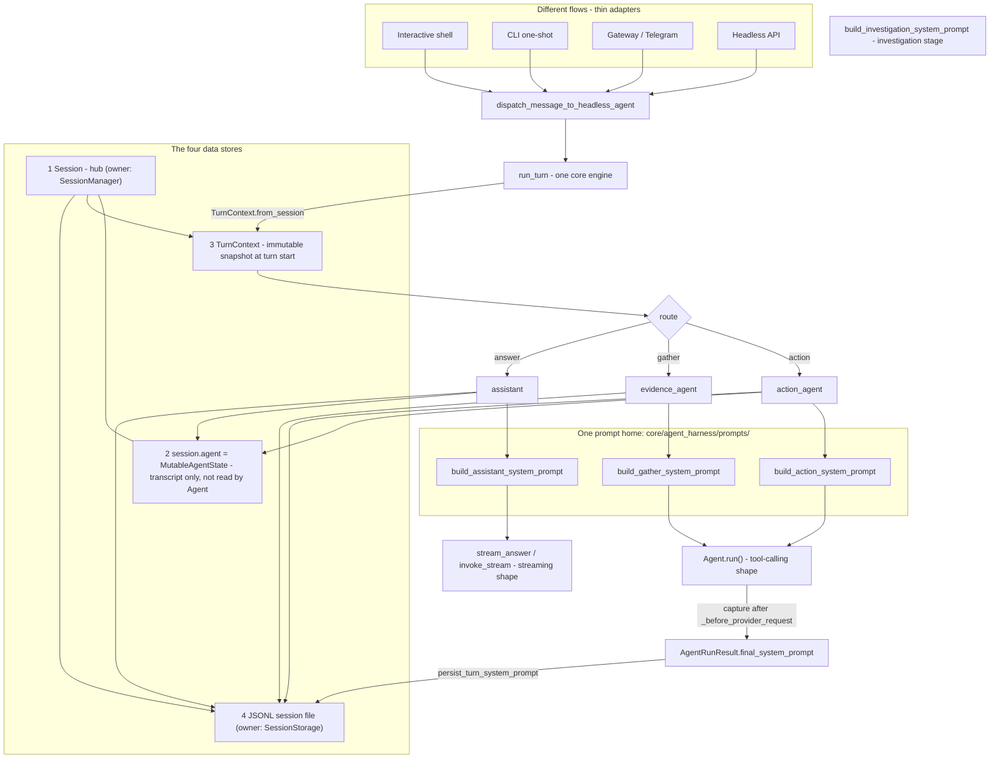
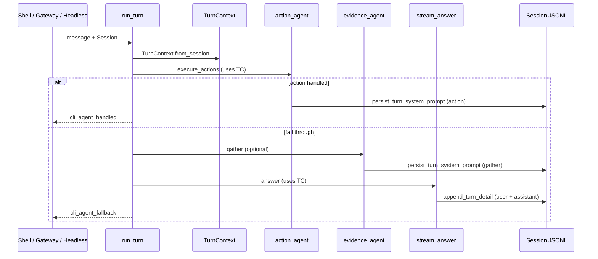

# Agent context and data stores

> **Start here** if you are asking: *what state is the agent looking at right
> now?* or *where do I debug the prompt that was sent to the model?*

This page maps the four in-memory/on-disk stores, how they relate, and where
to look when something diverges between shell, gateway, and headless paths.

---

## Quick lookup

| I want to… | Look at… |
|------------|----------|
| See live session state (integrations, history, metrics) | `Session` — `core/agent_harness/session/state.py` |
| See the chat transcript the assistant uses | `session.agent.messages` (`MutableAgentState`) |
| See what one turn looked like **at turn start** | `TurnContext.from_session(text, session)` |
| Resume or trace a past session | JSONL file — `~/.opensre/sessions/{session_id}.jsonl` |
| See the **system prompt** sent to `Agent.run` | `AgentRunResult.final_system_prompt` (in-memory) or JSONL `role=system` entries |
| See the **user-facing composed prompt** for the assistant | Session JSONL `message` user rows, or `~/.config/opensre/prompt_log.jsonl` (shell only) |
| Understand turn routing (action vs answer) | `run_turn` — `core/agent_harness/agents/turn_orchestrator.py` |

---

## Architecture (four stores)

One picture: the four surfaces funnel into one core engine; the four stores
(numbered) carry state through the turn; the four prompt builders live in one
home; and the assembled prompt is captured for debugging.



**Rule of thumb**

| Store | One-line job |
|-------|----------------|
| `Session` | Everything this process remembers |
| `MutableAgentState` (`session.agent`) | The chat transcript + last tool observation |
| `TurnContext` | A frozen photo of session state at turn start |
| JSONL session file | Durable copy for `/resume`, `/trace`, and audit |

---

## Turn flow (one message)



All surfaces call the same `run_turn` engine. Gateway uses
`Agent.dispatch_message_to_headless_agent` with `DefaultToolProvider(session, …)`
so action tools resolve from the **live** session integrations each turn (same as
shell).

---

## Glossary (disambiguation)

| Name | What it is **not** |
|------|---------------------|
| `MutableAgentState` | Not `core.agent.Agent` state; not investigation `AgentState` TypedDict |
| `TurnContext` | Not `ReplRuntimeContext`, `GroundingContext`, or `ActionToolContext` |
| `AgentContextInput` | Not a store — selector output from `select_agent_context_input()` |
| `Agent.run(agent_context=…)` | Not used on live shell/gateway paths yet (tests only); production uses `AgentConfig` |
| `PromptRecorder` | Not the system prompt — records user prompt + assistant response (shell telemetry) |

---

## Store 1 — `Session`

**File:** `core/agent_harness/session/state.py`  
**Lifecycle:** `SessionManager` — `core/agent_harness/session/manager.py`

Composition (not a grab-bag):

| Slice | Type | Role |
|-------|------|------|
| `session.agent` | `MutableAgentState` | Transcript |
| `session.storage` | `SessionStorage` | JSONL writer |
| `session.tokens` | `TokenUsage` | Token accounting |
| `session.metrics` | `TerminalMetrics` | Terminal metrics |
| `session.resolved_integrations_cache` | `dict` | Integration configs for tools |

Used by **every** surface (shell, gateway, headless). Gateway chat sessions are
hydrated by `SessionResolver` before each turn.

---

## Store 2 — `MutableAgentState` (audit)

**File:** `core/context/state/agent_state.py`  
**Access:** `session.agent` (compatibility: `session.cli_agent_messages`,
`session.last_command_observation`)

### Production API (use these)

| API | Purpose |
|-----|---------|
| `.messages` / setter | Conversation `(role, text)` pairs |
| `.last_observation` | Last tool/command output for grounding |
| `.clear()` | Reset on `/new` |

### Unused in production (tests / future only)

| API | Status |
|-----|--------|
| `set_system_prompt`, `set_model`, `set_*_tools` | Never called on live paths |
| `begin_run` / `end_run`, `mark_tool_pending` | Never called on live paths |
| `subscribe()`, `snapshot()` | Test-only |
| `record_turn()` | Orchestrator appends to `cli_agent_messages` directly instead |

**Important:** `core.agent.Agent` does **not** read `MutableAgentState`. Tools
and system prompts are assembled per turn via `TurnContext` + `AgentConfig`.

**Follow-up:** slim the class to transcript + observation only (issue #3434).

---

## Store 3 — `TurnContext` (unified)

**File:** `core/agent_harness/models/turn_context.py`  
**There is exactly one type** — no `ShellTurnContext` or surface variants.

Built once per turn:

```python
turn_ctx = TurnContext.from_session(text, session)
```

Passed to action prompts, assistant prompts, and shell adapters. The live
`Session` is still passed separately for writes (history, tokens, persistence).

### Field reference

| Field | Populated by `from_session`? | Used by |
|-------|------------------------------|---------|
| `text` | Yes | All agents |
| `conversation_messages` | Yes (capped) | Action + assistant prompts |
| `configured_integrations` | Yes | Prompts, tool availability |
| `last_state` | Yes | Follow-up grounding (RCA) |
| `last_synthetic_observation_path` | Yes | Synthetic failure context |
| `reasoning_effort` | Yes | LLM calls |
| `last_observation` | Yes (session → agent → runtime input) | Assistant grounding |
| `system_prompt`, `active_tools`, … | Only if `select_agent_context_input` populated | `Agent.run(agent_context=…)` tests |
| `working_directory`, `terminal_capabilities`, … | **No** (reserved / unused) | Do not rely on these |

Runtime-request fields are empty in production because `MutableAgentState` is
never populated with tools/prompt — builders read `TurnContext` snapshot fields
and assemble `AgentConfig` separately.

**Gather alignment:** prefer `build_gather_system_prompt_from_turn_context(turn_ctx)`
when a snapshot exists; the session-only overload remains for adapters.

---

## Store 4 — JSONL session file

**Path:** `~/.opensre/sessions/{session_id}.jsonl`  
**Protocol:** `SessionStorage` — `core/agent_harness/session/types.py`

| Entry type | Contents |
|------------|----------|
| `session` | Header (version, working directory, opensre version) |
| `message` | User/assistant/system chat rows + metadata |
| `tool_call` / `tool_result` | Tool execution audit |
| `compaction` | Context compaction summary |
| `investigation_result` | RCA output |
| `custom_message` / `turn_stub` | Turn kind stubs from `Session.record` |

Reload: `SessionRepo.load_session` → `SessionManager.restore_context`.

---

## Prompt recording (debug)

Three layers — know which you need:

| Layer | What is captured | Where | Surfaces |
|-------|------------------|-------|----------|
| **A. `AgentRunResult.final_system_prompt`** | Exact system string after `_before_provider_request` | In-memory on `Agent.run` result | Action + gather (`Agent.run`) |
| **B. `persist_turn_system_prompt`** | Same system prompt appended to JSONL | `message` row, `role=system`, `metadata.debug=system_prompt` | Action + gather (wired in harness) |
| **C. `append_turn_detail`** | User prompt + assistant response (+ optional `metadata.system_prompt` from `LlmRunInfo`) | Session JSONL `message` rows | Gateway/headless via `DefaultTurnAccounting`; shell via `PromptRecorder.flush` |
| **D. `PromptRecorder`** | User prompt + response text (telemetry) | `~/.config/opensre/prompt_log.jsonl` | Shell only |

### Debug cookbook

**Find action/gather system prompt in session file:**

```bash
jq 'select(.type=="message" and .role=="system")' \
  ~/.opensre/sessions/YOUR_SESSION_ID.jsonl
```

**Find assistant turn with metadata:**

```bash
jq 'select(.type=="message" and .metadata.kind=="chat")' \
  ~/.opensre/sessions/YOUR_SESSION_ID.jsonl
```

**Shell global prompt log:**

```bash
tail -f ~/.config/opensre/prompt_log.jsonl
# Disable: OPENSRE_PROMPT_LOG_DISABLED=1
# Path override: OPENSRE_PROMPT_LOG_PATH
```

**In code after `Agent.run`:**

```python
result.final_system_prompt  # last system prompt sent to the provider
```

### Verify it yourself

**Real session (needs an LLM key).** Run a turn, then read the prompt back out of
the newest session file — no need to know the session id:

```bash
uv run opensre           # ask anything that hits the agent, then exit
newest=$(ls -t ~/.opensre/sessions/*.jsonl | head -1)
jq 'select(.type=="message" and .role=="system") | {kind: .metadata.kind, content}' "$newest"
```

You should see the assembled system prompt with `kind` = `action_agent` or
`gather_agent` — the thing this issue said was never recorded.

**No key (deterministic).** Proves capture → persist → read-back with a fake LLM
and a throwaway session:

```python
import json
from core.agent import Agent
from core.agent_harness.debug.prompt_trace import persist_turn_system_prompt
from core.agent_harness.prompts import build_gather_system_prompt
from core.agent_harness.session.paths import session_path
from core.agent_harness.session.storage.jsonl import JsonlSessionStorage
from core.llm.types import AgentLLMResponse


class FakeLLM:
    def tool_schemas(self, tools):
        return []

    def invoke(self, messages, *, system=None, tools=None):
        return AgentLLMResponse(content="done", tool_calls=[], raw_content=None)

    def build_assistant_message(self, content, tool_calls):
        return {"role": "assistant", "content": content}


class Sess:
    configured_integrations = ("github",)
    storage = JsonlSessionStorage()
    session_id = "prompt-verify-demo"
    started_at = 1700000000.0


system = build_gather_system_prompt(Sess())
result = Agent(llm=FakeLLM(), system=system, tools=[], resolved_integrations={}, max_iterations=1).run(
    [{"role": "user", "content": "hi"}]
)
Sess.storage.open_session(Sess())
persist_turn_system_prompt(Sess(), phase="gather_agent", system_prompt=result.final_system_prompt)

path = session_path("prompt-verify-demo")
rows = [json.loads(x) for x in path.read_text().splitlines()]
system_row = next(r for r in rows if r.get("role") == "system")
assert system_row["content"] == result.final_system_prompt  # captured == persisted
print("OK:", system_row["metadata"])
path.unlink()
```

### Prompt builders (single harness home)

| Phase | Builder | Module |
|-------|---------|--------|
| Action | `build_action_system_prompt` | `core/agent_harness/prompts/` |
| Assistant | `build_assistant_system_prompt` | `core/agent_harness/prompts/` |
| Gather | `build_gather_system_prompt` / `_from_turn_context` | `core/agent_harness/prompts/gather.py` |
| Investigation | `build_investigation_system_prompt` | `tools/investigation/stages/gather_evidence/prompt.py` |

The assistant path is the **direct answer** shape (no tools): it streams via
`invoke_stream(prompt)` and does not use `Agent.run` (the tool-calling shape).
The two shapes are described in `core/agent_harness/AGENTS.md`.

---

## Related docs

- `core/agent_harness/AGENTS.md` — package boundaries, session lifecycle, agent construction
- `gateway/AGENTS.md` — gateway turn handler and per-chat sessions

---

## Follow-ups (issue #3434)

1. Slim `MutableAgentState` to transcript + observation only
2. Wire assistant composed prompt split into system vs user blocks in JSONL
3. Route production action/gather through `Agent.run(agent_context=TurnContext)` instead of parallel `AgentConfig` assembly
4. Populate or remove reserved `TurnContext` shell fields (`working_directory`, etc.)
