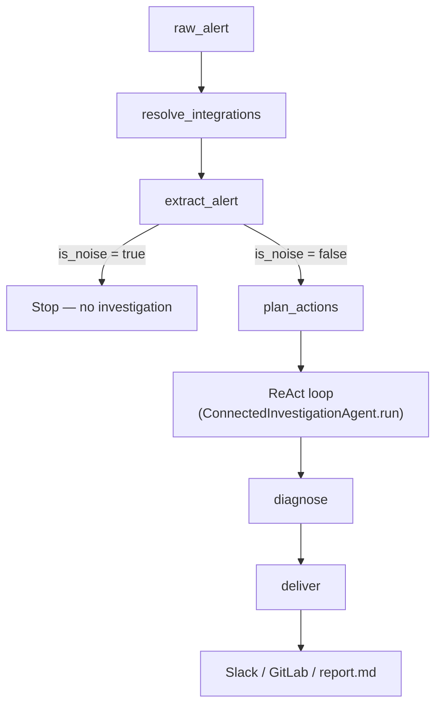
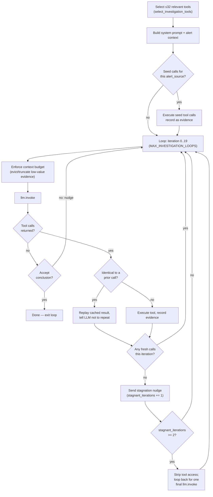

# Investigation pipeline architecture

Contributor guide to how a single investigation runs end-to-end: the six-stage
pipeline, the ReAct evidence-gathering loop, and the guardrails that keep it
bounded. Companion to
[`investigation-tool-calling.md`](investigation-tool-calling.md), which covers
tool schema / LLM invoke payload mechanics specifically — this doc covers the
pipeline and loop control flow around that.

## Where code lives

| Concern                        | Location                                                                                       |
| ------------------------------- | ------------------------------------------------------------------------------------------------ |
| Stage ordering                  | `tools/investigation/lifecycle.py` (`run_connected_investigation`)                             |
| Public runner entrypoint        | `tools/investigation/capability.py`                                                            |
| Integration discovery           | `tools/investigation/stages/resolve_integrations/node.py`                                      |
| Alert classification/extraction | `tools/investigation/stages/intake/node.py`                                                    |
| Pre-loop tool planning          | `tools/investigation/stages/plan_evidence/node.py`, `core/domain/alerts/tool_planning.py`      |
| ReAct loop (the agent)          | `tools/investigation/stages/gather_evidence/{agent,loop,tools,prompt}.py`                      |
| Diagnosis parsing               | `tools/investigation/stages/diagnose/node.py`, `core/domain/diagnosis`                          |
| Report delivery                 | `tools/investigation/reporting/`                                                                |
| Shared state contract           | `core/state/` (`AgentState`, `InvestigationState`, `EvidenceEntry`)                    |
| Context budget enforcement      | `core/context_budget.py`                                                                        |

## Pipeline overview

Each stage is a pure function — `(state) -> dict of updates`, merged into a
shared `AgentState` via `apply_state_updates`. A stage exception is reported
to Sentry and then re-raised; the pipeline never silently swallows a failure.

## Stage by stage

### 1. `resolve_integrations` — what tools exist

Looks up which vendor integrations (Datadog, Grafana, EKS, …) this org has
connected and credentialed. Not alert-specific — establishes the universe of
tools everything downstream can draw from.

### 2. `extract_alert` — is this worth investigating

One LLM call classifies the raw alert: noise (chat, greetings, replies in an
existing thread) short-circuits the pipeline immediately with no tools run.
A real alert gets structured fields extracted — `alert_name`, `severity`,
`alert_source`, namespace, error message — plus a computed `incident_window`.

### 3. `plan_actions` — what to check first

Scores every available tool against the alert (`score_tools`, source match +
tool metadata) and keeps the top `tool_budget` (default 10) as
`planned_actions`, with a written rationale. Advisory: if nothing scores
confidently, the loop falls back to its own relevance ranking instead of an
empty plan.

### 4. The ReAct loop — the core evidence-gathering agent

`ConnectedInvestigationAgent.run()` in
`tools/investigation/stages/gather_evidence/agent.py`. Before the
model's first turn: the tool set is narrowed to a hard cap
(`select_investigation_tools`, `MAX_AGENT_TOOL_SCHEMAS = 32`) using the plan
from stage 3 if present, otherwise alert-source relevance ranking. A handful
of "obviously needed" tools may fire as deterministic **seed calls** before
the LLM gets a turn at all, so the loop starts with free evidence already in
hand.

Guardrails inside the loop:

- **Duplicate detection** (`InvestigationToolCallCache`) — identical
  tool name + args is served from cache instead of re-executed, and the LLM
  is told explicitly it already has that result.
- **Stagnation breaker** — any iteration where every tool call was a
  replayed duplicate (no fresh evidence) appends a nudge telling the model to
  stop repeating itself and try something different. After
  `MAX_STAGNANT_ITERATIONS = 2` such iterations in a row (two nudges), tool
  access is stripped on the next turn to force a text-only conclusion rather
  than burning the rest of the loop budget.
- **CLI-backed models** (Codex, Claude Code CLI) use a subclass,
  `CLIBackedInvestigationAgent`, that overrides conclusion acceptance to
  refuse an early stop until every planned tool has been called — these
  models tend to write a final answer as soon as they see *some* results.
- **LLM invoke failures** degrade to a partial "investigation failed" state
  (`degraded_investigation_from_llm_failure`) instead of crashing, preserving
  whatever evidence was already gathered.

### 5. `diagnose` — structure the conclusion

The loop's final free-text answer is unstructured. A separate LLM call
(structured output) parses it into `root_cause`, `root_cause_category`,
`causal_chain`, `validated_claims` / `non_validated_claims`,
`remediation_steps`, and a `validity_score`, with a legacy regex-based
fallback (`parse_root_cause`) if structured parsing fails.

### 6. `deliver` — publish it

Formats and ships the report to the destinations configured in `state` —
Slack, GitLab writeback, local `report.md`, etc. See
[`tools/investigation/reporting/`](https://github.com/Tracer-Cloud/opensre/tree/main/tools/investigation/reporting/).

## Guardrails at a glance

| Guardrail            | Constant                              | Defined in                                   | Purpose                                                        |
| --------------------- | -------------------------------------- | ---------------------------------------------- | ---------------------------------------------------------------- |
| Tool schema cap       | `MAX_AGENT_TOOL_SCHEMAS = 32`         | `tools/investigation/stages/gather_evidence/tools.py` | Bounds per-turn schema payload regardless of registry size.    |
| Secondary tool reserve | `MAX_SECONDARY_FALLBACK_TOOLS = 3`    | `tools/investigation/stages/gather_evidence/tools.py` | Guarantees cheap reasoning/knowledge tools survive the cap.     |
| Loop iteration cap    | `MAX_INVESTIGATION_LOOPS = 20`        | `config/constants/investigation.py`           | Worst-case runtime bound for the ReAct loop.                   |
| Stagnation breaker    | `MAX_STAGNANT_ITERATIONS = 2`         | `tools/investigation/stages/gather_evidence/tools.py` | Stops the loop from spinning on duplicate-only iterations.     |
| Context budget        | `context_budget_ceiling_for_model()`  | `core/context_budget.py`                      | Evicts/truncates lowest-value evidence before the model's context limit. |
| Pre-loop plan size    | `tool_budget` (default 10)            | `tools/investigation/stages/plan_evidence/node.py` | Shortlist size the plan hands the loop before it even starts.  |

## Related docs

- [`investigation-tool-calling.md`](investigation-tool-calling.md) — tool
  schema / LLM invoke payload mechanics, per provider.
- [`AGENTS.md`](https://github.com/Tracer-Cloud/opensre/blob/main/AGENTS.md) —
  "Changing the investigation pipeline" entry point and checklist for making
  changes here.
